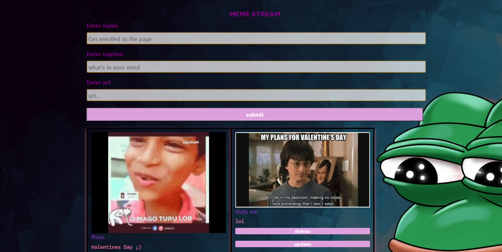
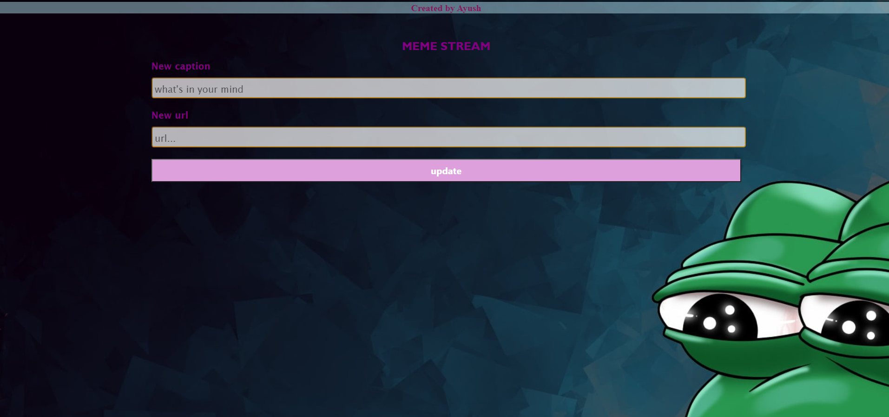

# Introduction

 Holla gente , welcome to XMEME . A web app which enables us to post memes and have a fun time watching the meme gallery
 created by the contribution of user with creative SOH and laugh out loud with the expanse of memes.

# About the app

The website is featured to post memes , if not happy then , delete a meme , if confused , udate a meme.  
User can post the meme out of their library with creative caption.   
The app will display all contributed memes with username who created and also with imaginative caption.  
One can update any meme with a new caption and with new image. All it requires is the image url which will automatically fetch the image to the gallery and bind up the user's credentials.

# OVERVIEW

# Techstack

- BACKEND:- NODE.js , EXPRESS , MONGODB for Database

# API

The frontend and backend are connected via REST API.  
- An HTTP POST request thorugh the form sending the data - name , url , caption to the database.  

- FETCH API to send a delete request if any made by the user.  

- PATCH API to update any pre loaded data. Every meme is assigned with a unique id is handled by the update/:id request

- An HTTP GET request by the handler function to /memes responding a JSON with unique ID assigned to each post.

- /memes/:id call uses the unique assigned id to fetch information from the database if a valid entry is executed.

<h3> Dependencies

- express , mongoose , request , ejs , system-sleep , method-override

<h4> Installation

- install.sh - install npm , dependencies mentioned to source directory (/src) , mongoose for model creation (/models) 

- npm install

- server_run.sh (/src) - npm start

<h4> start script - node src/app.js

# UPDATES

- User Authentication can be introduced in order to maintain the decency of the page.

- memes could be previewed in order of likes and wishlist for a user.

- Categorising memes.    

- <h1> YALA <a> http://surfer-xmeme.herokuapp.com/ </a>

